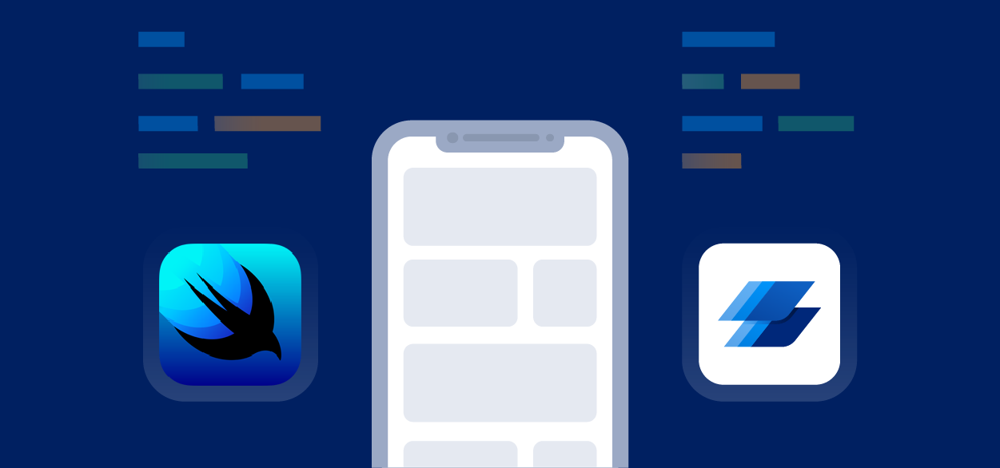

```
SwiftUi sample application 😎
```



# App specification.

* This is native iOS mobile application, which is developed by using [SwiftUi](https://developer.apple.com/xcode/swiftui/).
* The target crowd for this application is iPhone holders
* There wasn't any dependency management tool used in this mobile application
* All the support components were build in the application itself(including an image loader from an url).
* Architectural patterns, used here was MVVM

# Contents

* [App Structure](#app-structure)
* [Install, Configure & Run](#install-configure--run)

# Global Requisites

* xCode - 12
* macOS Big Sur - 11.3.1

# App Structure

> _Note: I am mentioning only files/folders which you need to configure if required_

```bash
├── SampleSwiftUI
│   ├── SharedServices
│   │   ├── Models
│   │   │   ├── Log.swift
│   │   │   ├── Problem.swift
│   │   │   ├── Area.swift
│   │   │   ├── MaintenanceRequest.swift
│   │   │   ├── Response.swift
│   │   │   ├── Property.swift
│   │   │   └── OverviewCard.swift
│   │   ├── Extensions.swift
│   │   ├── LoadViewModel.swift
│   │   └── CustomBackButton.swift
│   ├── Components
│   │   ├── CustomButton.swift
│   │   ├── URLImage.swift
│   │   └── ActivityIndicator.swift
│   ├── Dashboard
│   │   ├── Overview
│   │   │   ├── Components
│   │   │   │   ├── Tools.swift
│   │   │   │   └── Card.swift
│   │   │   └── Overview.swift
│   │   ├── RequestList
│   │   │   ├── Components
│   │   │   │   └── Record.swift
│   │   │   └── RequestList.swift
│   │   ├── MainTab.swift
│   │   └── DashboardViewModel.swift
│   ├── ViewRequest
│   │   ├── ViewRequest.swift
│   │   └── ViewRequestViewModel.swift
│   ├── Welcome
│   │   └── Welcome.swift
│   ├── SampleSwiftUIApp.swift
│   ├── Info.plist
│   ├── utils
│   │   └── Constants.swift
│   ├── Resources
│   │   ├── MaintenanceData.json
│   │   ├── OverviewData.json
│   │   ├── Assets.xcassets
│   │   ├── Colors.xcassets
│   │   └── Fonts
│   │       ├── Inter-Black.ttf
│   │       ├── Inter-Bold.ttf
│   │       ├── Inter-ExtraBold.ttf
│   │       ├── Inter-Black.ttf
│   │       ├── Inter-ExtraLight.ttf
│   │       ├── Inter-Light.ttf
│   │       ├── Inter-Medium.ttf
│   │       ├── Inter-Regular.ttf
│   │       ├── Inter-SemiBold.ttf
│   │       └── Inter.ttf
│   └── Preview Content
│       └── Preview Assets.xcassets
│
├── SampleSwiftUITests
├── SampleSwiftUIUITests
└── Products
```

# Install, Configure & Run

Below mentioned are the steps to install, configure & run in your platform/distributions.

```bash
# Clone the repo.
git clone https://github.com/Isurumw/Sample-SwiftUi-App

# Run the app
just run the app via xCode;
```